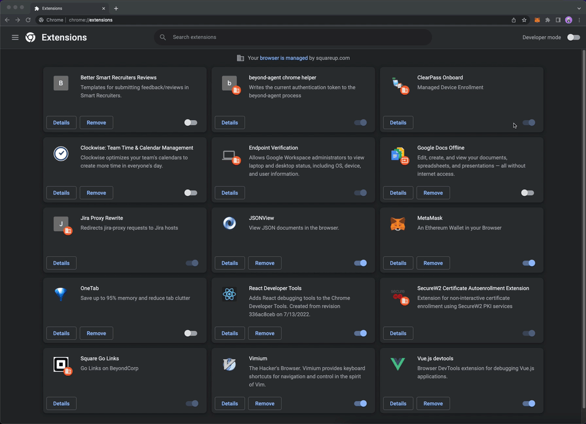

# Contributing Guide <!-- omit in toc -->
TODO: Add Intro here

# Table of Contents

- [Table of Contents](#table-of-contents)
- [Local Environment Setup](#local-environment-setup)
  - [Prerequisites](#prerequisites)
  - [Setup Instructions](#setup-instructions)
  - [Suggested Code Editor/IDE Setup](#suggested-code-editoride-setup)
    - [VS Code](#vs-code)
      - [Helpful Plugins](#helpful-plugins)
      - [Auto-format on Save](#auto-format-on-save)
- [Helpful Development Resources](#helpful-development-resources)

# Local Environment Setup

## Prerequisites
| Requirement | Tested Version | Installation Instructions                                                                                                                                                                                                                                                                                                         |
| ----------- | -------------- | --------------------------------------------------------------------------------------------------------------------------------------------------------------------------------------------------------------------------------------------------------------------------------------------------------------------------------- |
| `Node.js`   | `v16.17.0`     | There are many ways to install `Node.js`. Feel free to choose whichever approach you feel the most comfortable with. If you don't have a preferred installation method, you can visit the official [downloads](https://nodejs.org/en/download/) page and choose the the appropriate installer respective to your operating system |

## Setup Instructions
```bash
git clone https://github.com/TBD54566975/janky-wallet
cd janky-wallet
npm install
npm run dev
```
- pop open a chrome window
- navigate to `chrome://extensions`
- toggle _Developer Mode_ on (toggle should be on top right)
- click on _Load Unpacked_
- navigate to the cloned directory
- select the `dist` directory. The extension should now appear in the tiled list of installed extensions
- click the puzzle icon to the right of the omnibar
- click the pushpin icon next to Janky Wallet



## Suggested Code Editor/IDE Setup
### VS Code 
You can download VS Code from [here](https://code.visualstudio.com/)

#### Helpful Plugins
| Plugin                                                                                                      | Description                                                 |
| ----------------------------------------------------------------------------------------------------------- | ----------------------------------------------------------- |
| [Volar](https://marketplace.visualstudio.com/items?itemName=Vue.volar)                                      | Vue Language Features                                       |
| [Tailwind Intellisense](https://marketplace.visualstudio.com/items?itemName=bradlc.vscode-tailwindcss)      | auto-completes class-names and shows you the underlying CSS |
| [Path Intellisense](https://marketplace.visualstudio.com/items?itemName=christian-kohler.path-intellisense) | auto-completes paths                                        |
| [Rainbow Brackets](https://marketplace.visualstudio.com/items?itemName=2gua.rainbow-brackets)               | makes it really easy to spot out open/close brackets        |
| [GitLens](https://marketplace.visualstudio.com/items?itemName=eamodio.gitlens)                              | Easily view commits directly within the file you're editing | 

#### Auto-format on Save
This project uses [ESLint](https://eslint.org/) for linting and formatting code. If you want to automatically format the file you're working on everytime you save, follow the instructions below:
- open `settings.json`. [Reference](https://code.visualstudio.com/docs/getstarted/settings#_settingsjson)
- add these settings:
```json
  "editor.formatOnSave": true,
  "editor.codeActionsOnSave": {
    "source.fixAll.eslint": true
  },
```

# Helpful Development Resources
* [Chrome Extension Developer Docs](https://developer.chrome.com/docs/extensions/reference/)