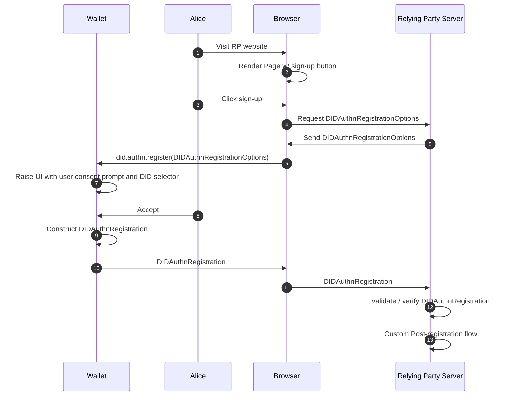

# `web5.did.authn` <!-- omit in toc -->

⚠ **Incomplete**

Author(s): Daniel Buchner, Moe Jangda

# Table of Contents <!-- omit in toc -->

- [Overview](#overview)
- [Synopsis](#synopsis)
  - [Registration](#registration)
  - [`DIDAuthnRegistrationOptions`](#didauthnregistrationoptions)
- [Notable Points](#notable-points)
- [Challenges](#challenges)
- [Open Questions](#open-questions)

# Overview
Initiates DID-based passwordless registration / login flows


# Synopsis

## Registration



## `DIDAuthnRegistrationOptions`

```typescript
type DIDAuthnRegistrationOptions = {
  /**
   * MUST be randomly generated by Relying Parties in an environment they trust (e.g., on the server-side), 
   * and the returned challenge value in the client’s response MUST match what was generated. 
   * This SHOULD be done in a fashion that does not rely upon a client’s behavior, e.g., 
   * the Relying Party SHOULD store the challenge temporarily until the operation is complete. 
   * Tolerating a mismatch will compromise the security of the protocol.
   * In order to prevent replay attacks, the challenges MUST contain enough entropy to make guessing 
   * them infeasible. Challenges SHOULD therefore be at least 16 bytes long.
   */
  challenge: String
  /**
   * a list of DID methods supported by the RP
   */
  didMethods: String[]
  rp: {
    /**
     * A human-palatable name for the relying party.
     */
    name: String
  },
  user: {
    /**
     * https://infra.spec.whatwg.org/#byte-sequences
     * opaque byte sequence with a maximum size of 64 bytes, and 
     * is not meant to be displayed to the user. It MUST NOT contain 
     * personally identifying information.
     * 
     * The main use of the user id is to identify the user account during 
     * authentication the user handle  is chosen by the Relying Party 
     * and ought to be the same for all credentials registered 
     * to the same user account.
     */
    id: String
  }
}
```

# Notable Points
* Attempt to follow WebAuthn as much as possible in hopes to reduce friction for browser adoption
* By design, WebAuthn requires that a different public key is used for each RP whereas DIDAuthn would allow the same DID to be used across many RPs

# Challenges
* combinatorial muck of supported DID Methods + supported key types 
* Authenticator support

# Open Questions
❓ RP ID: https://w3c.github.io/webauthn/#relying-party

❓ `user.id` relevant info: 
* https://w3c.github.io/webauthn/#dictdef-publickeycredentialuserentity
* https://w3c.github.io/webauthn/#user-handle
* https://w3c.github.io/webauthn/#sctn-user-handle-privacy

❓ `didMethods`
* do we need to provide the ability to declare supported key types like WebAuthn does? e.g. https://w3c.github.io/webauthn/#dom-publickeycredentialcreationoptions-pubkeycredparams

❓ include RP DID as optional field in `DIDAuthnRegistrationOptions`? what is gained by adding this?


**Related**:
* https://hackmd.io/tDUpbO8BQXimG6tL-bjF_A
* https://hackmd.io/32qbfIjETqS0Nb2jniyX3A