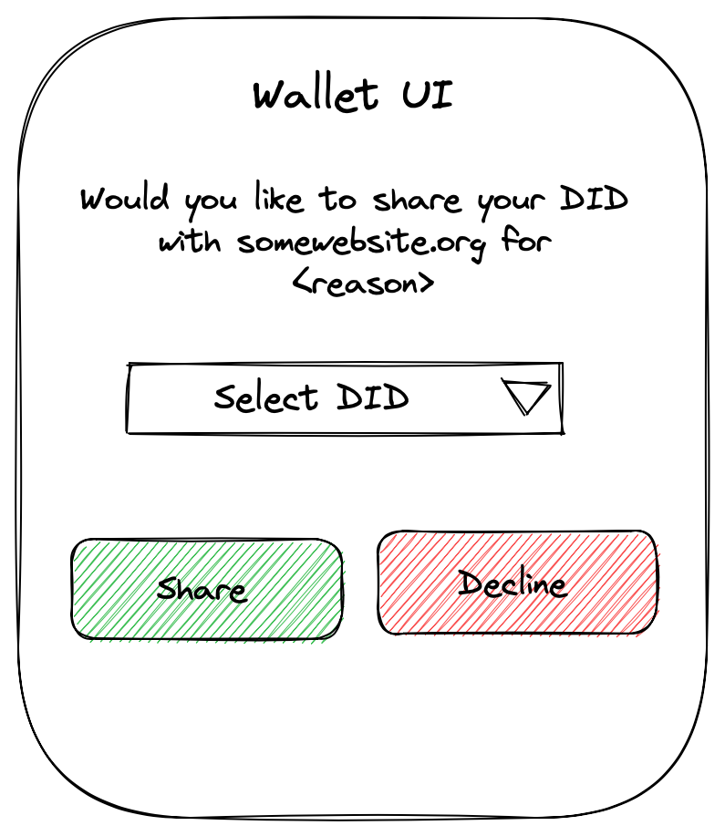

# `web5.did.request` <!-- omit in toc -->

Author(s): Daniel Buchner, Moe Jangda

# Table of Contents <!-- omit in toc -->
- [Overview](#overview)
- [Example Use Case(s)](#example-use-cases)
  - [Credential Issuance](#credential-issuance)
- [User Consent](#user-consent)
- [Synopsis](#synopsis)
  - [Signature](#signature)
  - [Arguments](#arguments)
    - [`DIDRequestOptions`](#didrequestoptions)
- [Security Considerations](#security-considerations)
- [Open Questions](#open-questions)

# Overview
This method can be used by clients to request a DID from a wallet owner. The wallet mediates access to clients in order to preserve user privacy. The wallet is responsible for ensuring that this operation is not performed without user consent.

# Example Use Case(s)
## Credential Issuance
Issuing a Verifiable Credential to an individual requires the individual to provide the issuer with a DID to issue the credential to (e.g. [`credentialSubject.id`](https://www.w3.org/TR/vc-data-model/#credential-subject))

# User Consent
The wallet is responsible for ensuring that this operation is not performed without user (aka wallet owner) consent. This means that the wallet must prompt the user and the user must explicitly agree to sharing a DID of their choice with the client



# Synopsis

## Signature
```typescript
function web5.did.request(didRequestOptions?: DIDRequestOptions): Promise<String>
```

## Arguments
### `DIDRequestOptions`
```typescript
type DIDRequestOptions = {
  /** a list of accepted DID methods */
  methods?: String[]
  /** client's reason for requesting a DID. Will be displayed to wallet controller */
  reason?: String
}
```

# Security Considerations
⚠ Sites lying about their intent with `reason`.

# Open Questions

❓ _What should be returned if the user declines to share? `null`? should an exception be thrown_

❓ _What should happen if the wallet doesn't support the methods supplied by the client?_


