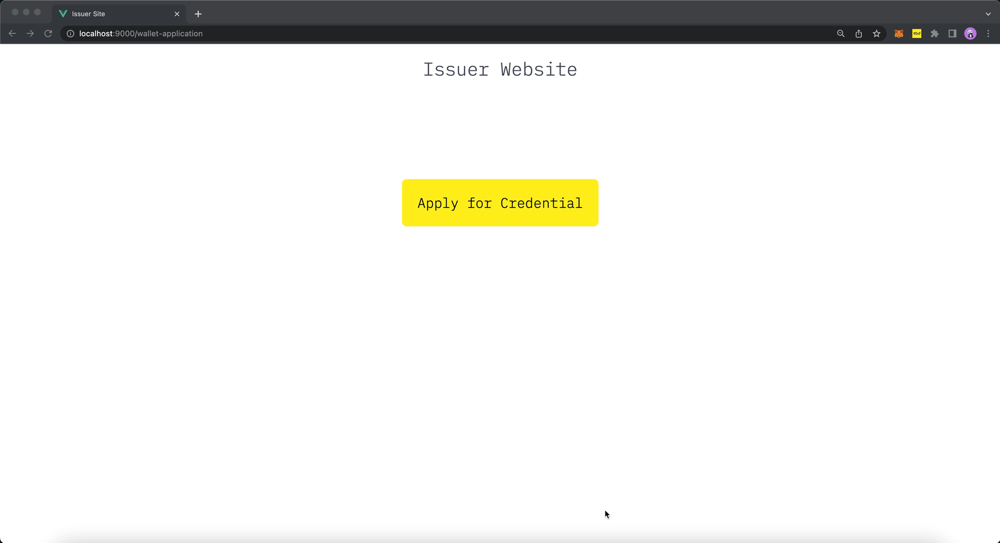

# `web5.vc.apply` <!-- omit in toc -->

Author(s): Daniel Buchner, Moe Jangda

# Table of Contents <!-- omit in toc -->
- [Overview](#overview)

# Overview
Initiates a credential application flow in the wallet using a [Credential Manifest](https://identity.foundation/credential-manifest/)

⚠ _TODO: Fill Out_
**Related**
* https://hackmd.io/KzFYvTA5SxGbb7emDPJBmg
* https://hackmd.io/EBTNW-42Q_2bjSldeFvzEA
* https://hackmd.io/kw1o89tETWejM9FXcVXeGw
* [Credential Manifest Spec](https://identity.foundation/credential-manifest/)
* [Presentation Exchange](https://identity.foundation/presentation-exchange/)